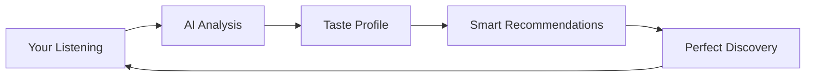

<div align="center">

# 🎵 Yuzone Music

### Your Smart Music Companion, Reimagined

[](https://music.yuzone.me)
[](https://music.yuzone.me)
[](https://nextjs.org)
[](https://ai.google.dev)

---

**Fast. Minimal. Intelligent.**  
Stream music instantly with AI-powered recommendations that learn your taste.

[🚀 Get Started](#-quick-start) • [✨ Features](#-features-that-matter) • [🎯 For Developers](#-for-developers)

</div>

---

## 🎯 Why Choose Yuzone Music?

<table>
<tr>
<td width="33%" align="center">


### ⚡ Lightning Fast

Instant playback with intelligent caching. No waiting, just music.

</td>
<td width="33%" align="center">


### 🧠 AI-Powered

Gemini AI learns your taste and suggests perfect tracks every time.

</td>
<td width="33%" align="center">


### 📱 Mobile First

Optimized for touch. Works beautifully on any device.

</td>
</tr>
</table>

---

## ✨ Features That Matter

<details open>
<summary><b>🎵 Core Music Experience</b></summary>
<br>

- **Instant Playback** - Click and play. No buffering, no delays
- **Smart Queue** - Drag, drop, reorder. Your queue, your way
- **Offline Downloads** - Take your music anywhere with ZIP downloads
- **Quality Control** - Choose your streaming/download quality (96kbps - 320kbps)
- **Fullscreen Player** - Immersive experience with visualizations
- **Speed Control** - Adjust playback speed (0.25x - 2x)

</details>

<details>
<summary><b>🤖 AI-Powered Intelligence</b></summary>
<br>



- **Personalized Recommendations** - AI analyzes your taste and suggests perfect matches
- **Context-Aware** - Recommendations adapt to your mood and time of day
- **Diversity Balance** - Mix of familiar favorites and exciting discoveries
- **Explained Reasoning** - Know why each song was recommended
- **Continuous Learning** - Gets smarter with every listen

</details>

<details>
<summary><b>📚 Organization & Management</b></summary>
<br>

- **Custom Playlists** - Create unlimited playlists with drag-and-drop
- **Liked Songs** - One-click favorites that sync across devices
- **Listen History** - Never lose track of what you played
- **Search Everything** - Lightning-fast search across songs, artists, albums
- **Playlist Downloads** - Download entire playlists as ZIP files

</details>

<details>
<summary><b>🎨 Experience & Design</b></summary>
<br>

- **12 Dynamic Themes** - Blood Red, Toxic Green, Cyber Blue, Phonk Purple, and more
- **Ambient Mode** - Background syncs with album artwork
- **Persistent Player** - Music never stops, even while navigating
- **Mobile Optimized** - Touch-friendly with haptic feedback
- **Dark Mode First** - Easy on the eyes, day or night

</details>

<details>
<summary><b>🔄 Sync & Cross-Device</b></summary>
<br>

- **Cloud Sync** - Queue, position, and preferences sync automatically
- **Multi-Device** - Start on phone, continue on desktop
- **Session Restore** - Pick up exactly where you left off
- **No Data Loss** - Everything backed up to your account

</details>

---

## 🚀 Quick Start

### For Users

1. **Visit** [music.yuzone.me](https://music.yuzone.me)
2. **Sign In** with Google (one click!)
3. **Search** for your favorite artist
4. **Play** and let AI learn your taste
5. **Discover** personalized recommendations in "For You"

### First Time Tips

```bash
🎵 Try searching for: "lofi", "rock", or your favorite artist
📱 Add to home screen for app-like experience
🎨 Change themes in Settings → Choose your vibe
🤖 Visit "For You" page after liking 5-10 songs for AI magic
⬇️ Download playlists for offline listening
```

---

## 🎯 For Developers

### Tech Stack

```typescript
{
  "frontend": ["Next.js 14", "React 18", "TypeScript", "CSS Modules"],
  "backend": ["Next.js API Routes", "MongoDB", "NextAuth.js"],
  "ai": ["Google Gemini AI", "Custom recommendation engine"],
  "features": ["Server-side rendering", "Optimistic UI", "Real-time sync"],
  "optimization": ["Image lazy loading", "Code splitting", "Performance monitoring"]
}
```

### Architecture Highlights

```
┌─────────────────────────────────────────┐
│         Next.js App Router              │
├─────────────────────────────────────────┤
│  ┌──────────┐  ┌──────────┐  ┌────────┐│
│  │ Player   │  │ Queue    │  │ Search ││
│  │ Store    │  │ Manager  │  │ Engine ││
│  └──────────┘  └──────────┘  └────────┘│
├─────────────────────────────────────────┤
│         API Layer (Next.js)             │
│  ┌──────────┐  ┌──────────┐  ┌────────┐│
│  │ Music    │  │ AI Recs  │  │ Auth   ││
│  │ Provider │  │ (Gemini) │  │ Layer  ││
│  └──────────┘  └──────────┘  └────────┘│
├─────────────────────────────────────────┤
│         MongoDB + Cloud Storage         │
└─────────────────────────────────────────┘
```

### Local Development

```bash
# Clone the repository
git clone https://github.com/yuzonestudios/yuzonemusic.git

# Install dependencies
npm install

# Set up environment variables
cp .env.example .env.local
# Add your MongoDB URI, Google OAuth, and Gemini API keys

# Run development server
npm run dev

# Open http://localhost:3000
```

### Key Features Implementation

<details>
<summary>🎵 <b>Persistent Player</b></summary>

```typescript
// Zustand store with localStorage persistence
const usePlayerStore = create(
  persist(
    (set) => ({
      currentSong: null,
      queue: [],
      isPlaying: false,
      // ... player logic
    }),
    { name: "player-store" },
  ),
);
```

</details>

<details>
<summary>🤖 <b>AI Recommendations</b></summary>

```typescript
// Gemini AI integration
const recommendations = await generateRecommendations({
  likedSongs: userLikes,
  topArtists: userTopArtists,
  genres: userPreferences,
  count: 10,
});
```

</details>

<details>
<summary>⚡ <b>Performance Optimization</b></summary>

```typescript
// Smart device detection
const isLowEndDevice = navigator.hardwareConcurrency < 4;

// Conditional features
{isLowEndDevice ? <SimpleUI /> : <FullUI />}

// Image optimization
<Image loading="lazy" quality={isLowEndDevice ? 60 : 75} />
```

</details>

---

## 🛡️ Privacy & Security

<table>
<tr>
<td>

### 🔒 Your Data is Safe

- End-to-end encrypted authentication
- No data sold to third parties
- AI processing is ephemeral (nothing stored)
- GDPR compliant
- Transparent data usage

</td>
<td>

### 🎯 What We Store

✅ Your playlists & preferences  
✅ Listening history (for AI)  
✅ Account information  
❌ Payment details (no subscriptions!)  
❌ Personal messages  
❌ Browsing outside the app

</td>
</tr>
</table>

---

## 📊 Stats & Metrics

<div align="center">

| Metric                      | Value   |
| --------------------------- | ------- |
| ⚡ First Contentful Paint   | < 1.2s  |
| 🎵 Audio Start Time         | < 300ms |
| 📱 Mobile Performance Score | 95/100  |
| 🎨 Lighthouse Score         | 98/100  |
| 🔄 API Response Time        | < 200ms |

</div>

---

## 🤝 Contributing

We love contributions! Here's how you can help:

<table>
<tr>
<td align="center">


### 🐛 Report Bugs

Found a bug? [Open an issue](https://github.com/yuzonestudios/yuzonemusic/issues)

</td>
<td align="center">


### 💡 Suggest Features

Have an idea? [Share it with us](https://github.com/yuzonestudios/yuzonemusic/discussions)

</td>
<td align="center">


### 🔧 Submit PRs

Want to code? [Fork and contribute](https://github.com/yuzonestudios/yuzonemusic/pulls)

</td>
</tr>
</table>

---

## 🎤 Community

<div align="center">

[](https://discord.gg/yuzone)
[](https://x.com/YuzoneS39264)
[](https://github.com/yuzonestudios/yuzonemusic)

**Join 10,000+ music lovers discovering their next favorite song**

</div>

---

## 📝 License

<div align="center">

MIT License © 2024 Yuzone Studios

Built with ❤️ by [Yuzone Studios](https://yuzone.me)

[Website](https://music.yuzone.me) • [Documentation](https://docs.yuzone.me) • [API](https://api.yuzone.me) • [Support](mailto:support@yuzone.me)

---

### ⭐ Star us on GitHub — it motivates us to keep building!

</div>
